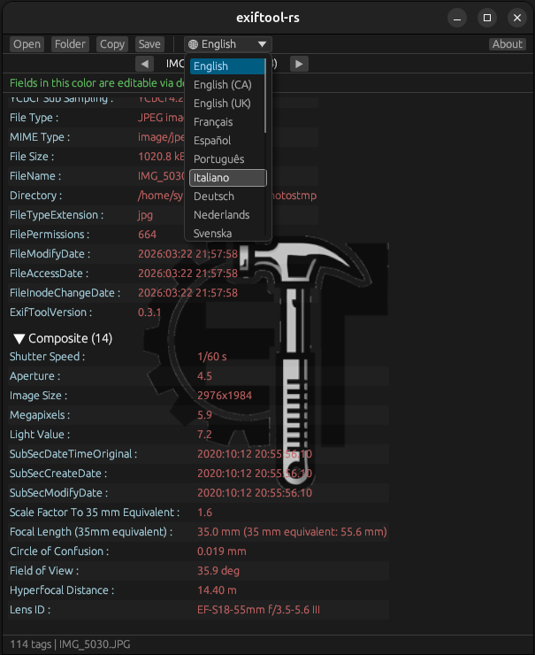

# exiftool-rs

[](https://crates.io/crates/exiftool-rs)
[](https://docs.rs/exiftool-rs)
[](LICENSE)

A pure Rust reimplementation of [ExifTool](https://exiftool.org/) v13.53 — read, write, and edit metadata in image, audio, video, and document files. No unsafe code, no Perl dependency, no system libraries.



## Features

- **194/194 test files (100%)** produce identical tag names as Perl ExifTool v13.53
- **93 format readers** covering all Perl ExifTool modules
- **15 format writers**: JPEG, TIFF, PNG, WebP, PSD, PDF, MP4, MKV, AVI, WAV, FLAC, MP3, OGG, CR2, HEIF/AVIF
- **17 MakerNote manufacturers** with deep sub-table decoders
- **Timed metadata extraction** (`-ee`) for dashcams, action cams, drones
- **Optional GUI** with 23 languages (3230 tags translated per language)
- **0 compiler warnings**, no unsafe code, minimal dependencies

## Supported Formats

### Read (93 format modules)

| Category | Formats |
|----------|---------|
| **Images** | JPEG, TIFF, PNG, WebP, PSD, BMP, GIF, HEIF/AVIF, ICO, PPM, PGF, BPG, XCF, MIFF, PICT, PCX, MNG, JXR, FLIF, Radiance HDR, OpenEXR, PSP, InDesign |
| **Raw** | CR2, CR3, CRW, CRM, NEF, DNG, ARW, ORF, RAF, RW2, PEF, SR2, SRW, X3F, IIQ, 3FR, ERF, MRW, Rawzor, KyoceraRaw |
| **Video** | MP4/MOV, AVI, MKV/WebM, MPEG, MTS/M2TS, WTV, DV, FLV, SWF, MXF, ASF/WMV, Real (RM/RAM) |
| **Audio** | MP3, FLAC, WAV, OGG, Opus, AAC, AIFF, APE, MPC, WavPack, DSF, Audible |
| **Documents** | PDF, RTF, HTML, PostScript, DjVu, OpenDocument (ODT/ODS/ODP/ODG), TNEF |
| **Fonts** | TrueType (TTF), OpenType (OTF), WOFF/WOFF2, AFM, PFA, PFB |
| **Scientific** | DICOM, MRC, FITS, XISF, DPX, LIF (Leica) |
| **Archives** | ZIP, 7Z, RAR, GZIP, ISO, Torrent |
| **Other** | EXE/ELF/Mach-O, LNK, VCard, ICS, JSON, PLIST, PCAP, MIE, MOI, Lytro LFP, FLIR FPF, CaptureOne EIP, Palm PDB, FlashPix (OLE), iWork, Red R3D |

### Write (15 formats)

| Category | Formats |
|----------|---------|
| **Images** | JPEG, TIFF, PNG, WebP, PSD |
| **Raw** | CR2, HEIF/AVIF |
| **Video** | MP4, MKV, AVI |
| **Audio** | MP3, FLAC, WAV, OGG |
| **Documents** | PDF |

### MakerNote Support (17 manufacturers)

| Manufacturer | Sub-table Decoders |
|-------------|-------------------|
| **Canon** | CameraSettings, ShotInfo, AFInfo, ColorData (WB), CustomFunctions, VRD, CIFF, CTMD |
| **Nikon** | NikonCapture (D-Lighting, Crop, ColorBoost, UnsharpMask), ScanIFD, CaptureOffsets |
| **Sony** | SonyIDC, lens tables (400+ entries) |
| **Pentax** | CameraSettings (K10D/K-5), AEInfo, LensInfo, FlashInfo, CameraInfo |
| **Olympus** | Equipment, CameraSettings, FocusInfo, RawDevelopment |
| **Panasonic** | RW2 sub-IFDs, AdvancedSceneMode composite |
| **Fujifilm** | RAF WB, PreviewImage |
| **Samsung** | MakerNote IFD |
| **Sigma** | MakerNote IFD, X3F raw |
| **Casio** | Type 1, Type 2 |
| **Ricoh** | MakerNote IFD |
| **Minolta** | MakerNote IFD |
| **Apple** | MakerNote IFD |
| **Google** | MakerNote IFD |
| **FLIR** | Thermal metadata, FPF |
| **GE** | MakerNote IFD |
| **GoPro** | GPMF timed metadata |

### Timed Metadata (`-ee`)

| Source | Formats |
|--------|---------|
| **Dashcams** | freeGPS (Novatek, Viofo, Azdome, Akaso, Vantrue, INNOVV, Nextbase), Kenwood (DRV-A510W) |
| **Action cams** | GoPro GPMF (GPS, accelerometer, gyroscope), Insta360 |
| **Drones** | DJI telemetry, Yuneec/Autel (subtitle tracks) |
| **Android** | Google CAMM (camera motion metadata, types 0-7) |
| **Generic** | NMEA sentences (RMC, GGA), RVMI, Garmin |

## Library Usage

```rust
use exiftool_rs::ExifTool;

let et = ExifTool::new();
let tags = et.extract_info("photo.jpg").unwrap();
for tag in &tags {
    println!("{}: {}", tag.name, tag.print_value);
}
```

### Features

| Feature | Description |
|---------|-------------|
| `gui` | Enable the graphical interface (`exiftool-rs-gui` binary) |
| `win-icon` | Embed Windows application icon in the binary (CLI builds only) |

> **Note for library consumers:** The `win-icon` feature should only be enabled when building standalone binaries. If you use `exiftool-rs` as a library dependency, do **not** enable `win-icon` — it would inject a Windows VERSION resource into your own binary and cause linker conflicts.

## CLI Usage

```bash
# Install (CLI only)
cargo install exiftool-rs

# Install with GUI
cargo install exiftool-rs --features gui

# Read metadata
exiftool-rs photo.jpg

# Short tag names
exiftool-rs -s photo.jpg

# JSON output
exiftool-rs -j photo.jpg

# Write tags
exiftool-rs -Artist="John Doe" -Copyright="2024" photo.jpg

# Show groups
exiftool-rs -G photo.jpg

# Numeric values
exiftool-rs -n photo.jpg

# Extract embedded GPS from dashcam video
exiftool-rs -ee video.mp4
```

## GUI

exiftool-rs includes an optional graphical interface built with [egui](https://github.com/emilk/egui).

```bash
# Install with GUI support
cargo install exiftool-rs --features gui

# Launch the GUI
exiftool-rs-gui

# Or with a specific language
exiftool-rs-gui -lang fr
```

**Features:**
- Open files or folders, navigate with arrow keys
- View all metadata grouped by category
- Double-click any writable tag to edit it
- Copy all metadata to clipboard
- Save edits back to the file
- 23 languages supported (CJK, Arabic, Hindi, Bengali fonts included via [noto-fonts-dl](https://crates.io/crates/noto-fonts-dl))

### Supported Languages (23)

| Code | Language | Code | Language | Code | Language |
|------|----------|------|----------|------|----------|
| `en` | English | `fr` | French | `pl` | Polish |
| `ar` | Arabic | `hi` | Hindi | `pt` | Portuguese |
| `bn` | Bengali | `it` | Italian | `ru` | Russian |
| `cs` | Czech | `ja` | Japanese | `sk` | Slovak |
| `de` | German | `ko` | Korean | `sv` | Swedish |
| `en_ca` | English (CA) | `nl` | Dutch | `tr` | Turkish |
| `en_gb` | English (UK) | `fi` | Finnish | `zh` | Chinese (Simplified) |
| `es` | Spanish | | | `zh_tw` | Chinese (Traditional) |

Each language includes 3230 translated tag descriptions plus all UI strings.

### Platform Notes

| OS | Icon in binary | Notes |
|----|---------------|-------|
| **Windows** | Opt-in | Icon embedded in `.exe` via `winres` when `win-icon` feature is enabled |
| **macOS** | No | Requires a `.app` bundle with `.icns` |
| **Linux** | No | ELF binaries don't support embedded icons |

## CLI Options

| Option | Description |
|--------|-------------|
| `-s` | Short tag names |
| `-s2` | Very short (tag names only) |
| `-G` | Show group names |
| `-n` | Numeric output (no print conversion) |
| `-j` | JSON output |
| `-csv` | CSV output |
| `-X` | XML/RDF output |
| `-b` | Binary output (thumbnails, etc.) |
| `-ee` | Extract embedded data (GPS from dashcams, etc.) |
| `-r` | Recursively scan directories |
| `-ext EXT` | Process only files with extension EXT |
| `-TAG` | Extract specific tag(s) |
| `-ver` | Show version |
| `-TAG=VALUE` | Write tag |
| `-TAG=` | Delete tag |
| `-overwrite_original` | Overwrite without backup |
| `-stay_open True` | Keep running, read commands from stdin |
| `-lang LANG` | Set language (GUI and tag descriptions) |
| `-v` | Verbose output |
| `-htmlDump` | HTML hex dump of file structure |
| `-validate` | Validate metadata |
| `-diff` | Show differences between files |
| `-args` | Print in ExifTool arg format |
| `-php` | PHP array output |
| `-progress` | Show progress during processing |
| `-scanForXMP` | Scan file for XMP data |

## Testing

```bash
# Unit tests
cargo test

# ISO-functional test against Perl ExifTool's 194 test files
# No Perl required — reference files included in tests/expected/
./scripts/test_iso.sh

# 194/194 files (100%) produce identical tag names — 11625 tags verified
```

## Building

```bash
git clone https://github.com/Le-Syl21/exiftool-rs
cd exiftool-rs

# CLI only
cargo build --release

# CLI + GUI
cargo build --release --features gui

# With Windows icon embedded in the .exe
cargo build --release --features win-icon
```

The `gui` feature is optional and not included by default. Without it, the GUI dependencies (egui, eframe, image, rfd, noto-fonts-dl) are not downloaded or compiled.

The `win-icon` feature embeds an icon into the Windows `.exe` via `winres`. It is disabled by default to avoid conflicts with frameworks like Tauri that manage their own Windows resources.

## License

GPL-3.0-or-later (same as the original Perl ExifTool)

## Authors

- **Sylvain** ([@Le-Syl21](https://github.com/Le-Syl21)) — Project creator
- **Claude** (Anthropic) — Implementation

## Acknowledgements

Based on [ExifTool](https://exiftool.org/) by Phil Harvey.
Tag tables and print conversions are generated from the ExifTool Perl source.
